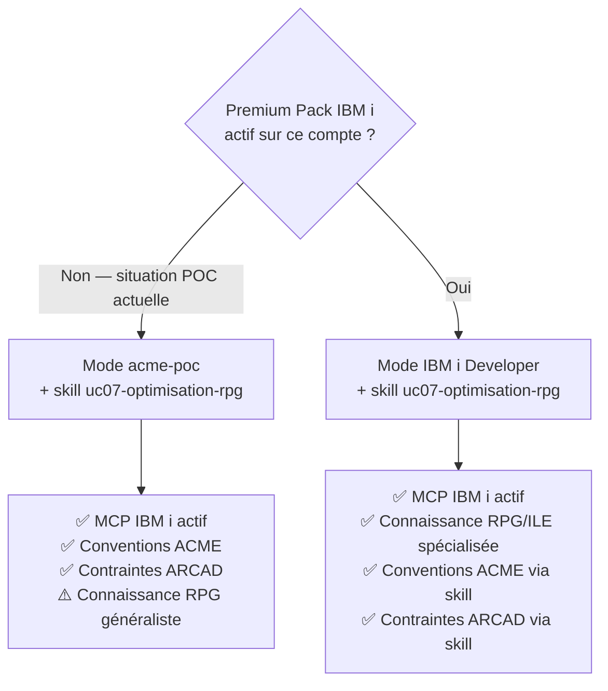
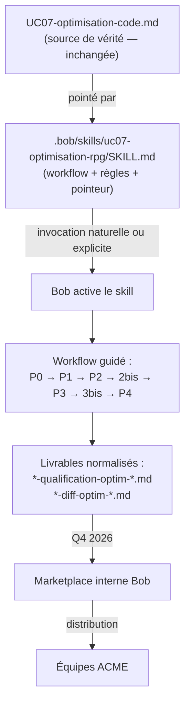

# Stratégie Skills — Industrialisation des Use Cases Bob

> **Contexte :** Ce document définit la stratégie d'industrialisation des use cases Bob (UCxx) sous forme de skills réutilisables, gouvernés et distribuables via la future marketplace Bob.
> Il complète les fiches UCxx.md sans les remplacer.

---

## Principe fondamental : une seule source de vérité

Les fichiers `UCxx-*.md` restent la **source de vérité**. Ils décrivent les règles métier, les standards de développement, les méthodologies de modernisation, les critères de qualité et les bonnes pratiques de l'entreprise.

Les skills ne dupliquent pas ce contenu — ils **pointent** vers les UCxx.md et ajoutent le workflow d'orchestration par-dessus.

```
UC07-optimisation-code.md   ← source de vérité (inchangée)
         ↑
         pointé par
         ↓
.bob/skills/uc07-optimisation-rpg/SKILL.md   ← pilote : workflow + règles + pointeur
```

Si un UCxx.md évolue, le skill associé en bénéficie automatiquement. Zéro double maintenance.

---

## Rôle des différents composants

| Composant | Rôle | Modifié par |
|-----------|------|-------------|
| `UCxx-*.md` | Source de vérité — règles, prompts, check-lists, pièges | Équipe méthode |
| `SKILL.md` | Pilote — workflow, règles absolues, pointeur vers UCxx.md | Équipe méthode |
| Slash commande `/ucxx-...` | Mécanisme d'invocation pratique | Équipe tooling |
| Mode `acme-poc` | Contexte ACME — conventions, ARCAD, langue | Équipe Bob |
| Mode `IBM i Developer` | Contexte RPG/ILE spécialisé (Premium Pack) | IBM (fourni) |

---

## Structure des skills dans le workspace

Le nom du **dossier** porte l'identité du skill. Le fichier s'appelle toujours `SKILL.md` — c'est une convention fixe de Bob. Aucun risque de conflit entre les 14 UC.

```
.bob/skills/
├── uc04-comprehension-rpg/
│   └── SKILL.md
├── uc05-regles-metier/
│   └── SKILL.md
├── uc07-optimisation-rpg/
│   └── SKILL.md       ← exemple développé dans ce document
└── uc14-dds-vers-ddl/
    └── SKILL.md
```

**Priorité en cas de conflit de nom :** le skill projet (`.bob/skills/`) prend toujours le dessus sur le skill global (`~/.bob/skills/`). Cela permet à ACME de surcharger un skill générique IBM i avec une version adaptée à ses conventions.

---

## Exemple complet — Skill UC07 Optimisation RPG

### Fichiers créés et leurs rôles

| Fichier | Rôle |
|---------|------|
| `.bob/skills/uc07-optimisation-rpg/SKILL.md` | Le skill — workflow, règles absolues, pointeur vers UC07.md |
| `UC07-optimisation-code.md` | Source de vérité — prompts P0→P5, check-list, pièges, conventions. **Inchangé.** |

### Contenu du `SKILL.md`

```markdown
---
name: UC07 — Optimisation RPG IBM i
description: >
  Optimise un programme RPG IBM i sans modifier sa logique fonctionnelle.
  Applique la méthodologie UC7 ACME : renommage des variables cryptiques,
  remplacement des opcodes obsolètes (MOVE, SETON, GOTO…), extraction de
  subroutines en procédures Free RPG.
  À activer quand l'utilisateur demande d'optimiser, moderniser, refactorer
  ou améliorer la lisibilité d'un programme RPG.
---

## Source de vérité

Ce skill applique la méthodologie définie dans @UC07-optimisation-code.md.
Lis ce fichier en entier avant de démarrer — il contient les prompts P0 à P5,
les règles de mode, les conventions de nommage et la check-list de validation.

## Règles absolues de ce skill

1. **Toujours commencer par le Prompt 0** — jamais directement les renommages.
   Le Prompt 0 détermine la catégorie SIMPLE / STANDARD / COMPLEXE et la séquence exacte.

2. **Rester en mode Ask** pendant toute la génération (Prompts 0 à 4).
   Basculer en mode Agent UNIQUEMENT pour :
   - Compilation de test : Prompts 2-bis et 3-bis (CRTBNDRPG)
   - Sauvegarde du diff validé

3. **Vérifier les prérequis** avant de démarrer :
   - Fichier *-comprehension-*.md (UC4) disponible → OBLIGATOIRE
   - Fichier *-regles-*.md (UC5) disponible → OBLIGATOIRE
   - IBM i MCP actif
   - Programme non verrouillé dans ARCAD

4. **Nommer les livrables** selon la convention ACME :
   {appArcad}-{fonction}-{composant}-{type}-{YYYYMMDD-HHmm}.md
   Types UC7 : qualification-optim | diff-optim | plan-optim

5. **Section "Questions ouvertes"** obligatoire en fin de chaque livrable.

6. **Mention ARCAD** dans l'en-tête de chaque diff :
   ⚠️ Réintégration ARCAD — à effectuer manuellement après validation

## Démarrage

Demande à l'utilisateur :
- Quel programme RPG optimiser ? (nom + bibliothèque)
- Les fichiers *-comprehension-*.md et *-regles-*.md sont-ils dans le workspace ?

Si les prérequis sont absents, recommander une session UC4 (30 min) avant de continuer.
```

---

### Quel mode utiliser pour ce skill ?

UC07 a une séquence mixte — le workflow alterne analyse (lecture seule) et actions (compilation, sauvegarde) :

| Phase UC07 | Opération | Mode requis |
|---|---|---|
| P0 → P4 (analyse, diffs) | Lire sources, générer du markdown | Ask suffit |
| P2-bis, P3-bis (compilation) | Lancer `CRTBNDRPG` via MCP IBM i | Agent |
| Sauvegarde diff validé | Écrire `*-diff-optim-*.md` | Agent |

Le skill orchestre ce basculement lui-même grâce au groupe `mode` — vous n'avez pas à changer de mode manuellement entre chaque prompt.

**Option 1 — Mode `acme-poc` (situation actuelle du POC)**

C'est le mode à utiliser aujourd'hui. Il contient tous les groupes nécessaires : `read`, `edit`, `mcp`, `skill`, `mode`. Le groupe `mode` permet à Bob de basculer autonomement vers Agent pour les compilations, puis de revenir.

Limite : le `roleDefinition` de `acme-poc` est généraliste POC — il contient les conventions ACME et les contraintes ARCAD, mais pas la connaissance spécialisée RPG/ILE embarquée dans un mode IBM i dédié.

**Option 2 — Mode `IBM i Developer` (si Premium Pack IBM i actif)**

Si le Premium Pack IBM i est activé, le mode `IBM i Developer` fourni par IBM est **supérieur à `acme-poc` pour UC07** pour une raison précise : son `roleDefinition` embarque une connaissance spécialisée RPG, ILE, DDS et SQL IBM i qui améliore la qualité des analyses, des renommages proposés et des détections d'opcodes obsolètes.

En pratique, sur UC07, cela se traduit par :
- Des renommages de variables plus pertinents sémantiquement (Bob connaît les patterns RPG courants : `WK`, `*IN`, `KLIST`, etc.)
- Une meilleure détection des risques de régression sur `MOVE`/`MOVEL` avec des longueurs différentes
- Une conversion des opcodes obsolètes plus fiable (connaissance native de la table `SETON` → `IND`)

Le skill `uc07-optimisation-rpg` reste utilisable dans ce mode et y ajoute les règles ACME (conventions de nommage, contraintes ARCAD, section "Questions ouvertes") que le mode IBM i natif ne connaît pas. **Le mode IBM i Developer et le skill sont complémentaires, pas exclusifs.**

**Décision selon la situation :**



> **Pour le POC ACME aujourd'hui :** démarrez en `acme-poc`. C'est le mode de référence défini dans le projet, il a tous les groupes nécessaires, et le skill apporte la méthodologie UC07 par-dessus.
>
> **Dès que le Premium Pack IBM i est confirmé actif :** basculer vers `IBM i Developer` + skill pour bénéficier des deux couches — la connaissance RPG native du mode et les règles ACME du skill.

---

### Ce que le skill apporte par rapport aux prompts directs

| Approche prompts (avant) | Approche skill (après) |
|--------------------------|------------------------|
| Trouver UC07.md | Taper *"Optimise le programme TRC0018"* |
| Lire la séquence des prompts | Bob détecte et active le skill automatiquement |
| Copier-coller chaque prompt | Bob suit la séquence P0 → P1 → P2 → ... |
| Gérer les changements de mode manuellement | Bob gère les basculements Ask ↔ Agent |
| Respecter la convention de nommage | Bob applique la convention ACME |
| Cocher manuellement la check-list | Bob vérifie les prérequis et la check-list |

---

### La boucle complète illustrée



---

## Cycle de vie d'un skill

```
1. Formalisation du use case dans UCxx.md
        ↓
2. Création du SKILL.md (pointeur + workflow + règles absolues)
        ↓
3. Test sur un composant pilote (ex. TRC0018)
        ↓
4. Validation et versioning dans le repository
        ↓
5. Distribution via partage de repository (aujourd'hui)
        ↓
6. Publication marketplace interne Bob (Q4 2026)
        ↓
7. Amélioration continue — UCxx.md évolue, skill en bénéficie automatiquement
```

---

## Roadmap de création des skills

| Priorité | UC | Slug du skill | Statut |
|----------|----|---------------|--------|
| 1 | UC07 — Optimisation code | `uc07-optimisation-rpg` | ✅ Créé |
| 2 | UC04 — Compréhension programme | `uc04-comprehension-rpg` | À créer |
| 3 | UC05 — Règles métier | `uc05-regles-metier` | À créer |
| 4 | UC14 — DDS vers DDL | `uc14-dds-vers-ddl` | À créer |
| 5 | UC06 — Documentation complète | `uc06-documentation` | À créer |
| 6 | UC08 — Restructuration code | `uc08-restructuration-rpg` | À créer |
| 7 | UC03 — SQL embarqué | `uc03-sql-embarque` | À créer |

**Critère de priorité :** maturité du UCxx.md + fréquence d'utilisation prévue dans le POC.

---

## Marketplace — disponibilité et préparation

**Q4 2026 — Marketplace interne Bob**
Distribution des skills au sein de l'organisation ACME. Mécanisme de publication non encore documenté — préparer dès maintenant la gouvernance et le versioning.

**2027 — Marketplace publique IBM (à confirmer)**
Extension vers un partage élargi. Point à confirmer lorsque la roadmap détaillée sera publiée.

**En attendant — partage via repository**
Les skills dans `.bob/skills/` sont versionnés dans le repository Git du projet. Distribution par clone ou copie du dossier `.bob/skills/` vers les autres workspaces de l'équipe.

---

*Document évolutif — à mettre à jour au fil de la création des skills et de l'évolution de la roadmap Bob.*
